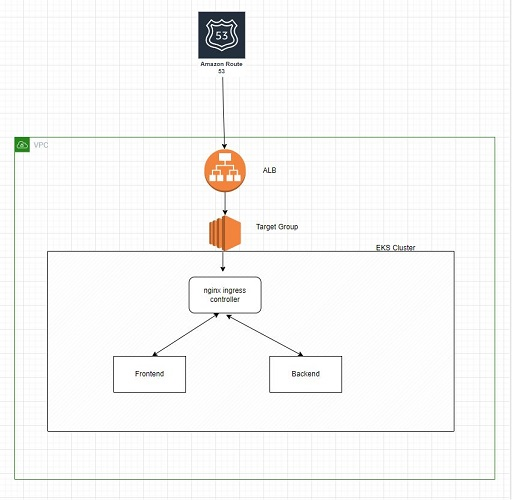

# Moon Active - Home Assignment
## Ready environment:
You can take a look on a running environment: https://ofekbb.com

# Microservices Deployment with Kubernetes
This project demonstrates the deployment of microservices on a Kubernetes cluster. The microservices are simple web applications that consume URL from environment variables or from path\buttons, send API requests, and return responses. 
The deployment is managed using Helm charts, allowing for easy configuration and scaling.

# GitHub Action Workflow
The workflow triggered manually with name of the service as a parameter (frontend\backend) and performs the following steps:
Pulls the source code from the repository.
Builds Docker images for the services, tagging them with the build number.
Pushes the Docker images to a Dockerhub registry.
Deploys the services to the Kubernetes cluster using Helm charts.
Runs tests with helm test to verify correct responses from the deployed services.

# MicroServices 
## Frontend: 
this microservice is responsible for rendering the UI and sending the url path to the backend,
and recived backend api response  

## Backend:
this microservice post api request that it recived from the frontend, and send it back to the frontend.

# Pathes
## Path: /uselessfact
Description: Retrieves a random fact from uselessfacts.jsph.pl.

## Path: /funnyfact
Description: Retrieves a random Chuck Norris joke from api.chucknorris.io.

## Path: /ready
Description: Responds with a status code of 200 from backend service, indicating that the service is ready.

## Path: /back-health
Description: Responds with a status code of 200 from backend service, indicating that the service is ready.

